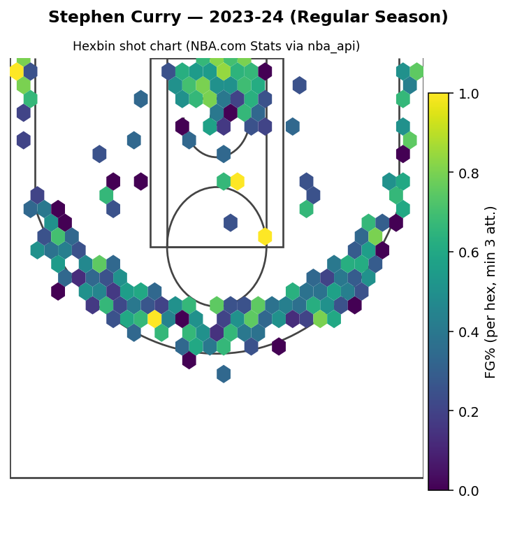

# NBA Shot Chart Visualizer v2.0

<div align="center">
  
</div>

**Real-time NBA shot analysis dashboard with machine learning-powered shot success predictions**

This project pulls live shot location data from the NBA.com Stats API via `nba_api` and renders interactive shot charts with ML-powered success probability predictions. Features a professional Streamlit dashboard with real-time updates, multi-player comparisons, and robust caching for reliable operation.

## Quickstart

### 1. Setup Environment
```bash
python -m venv .venv && source .venv/bin/activate
pip install -r requirements.txt
```

### 2. Run Dashboard
```bash
streamlit run app.py
```

The app opens in **Demo mode** by default, showing sample charts without requiring live data.

### 3. Enable Live Data (Optional)
Create `.streamlit/secrets.toml`:
```toml
NBA_API_HEADERS = "{\"User-Agent\":\"Mozilla/5.0\",\"x-nba-stats-origin\":\"stats\",\"Referer\":\"https://stats.nba.com/\"}"
```

Then uncheck "Demo mode" in the sidebar to fetch live NBA data.

## Features

### Interactive Dashboard
- **Charts Tab**: Individual player shot analysis with frequency/efficiency metrics
- **Compare Tab**: Side-by-side multi-player comparisons (up to 3 players)
- **Predictions Tab**: ML-powered shot success probability overlays

### Machine Learning Pipeline
- **Model Training**: Train on historical shot data with configurable features
- **Prediction Overlay**: Color-coded success probabilities on shot charts
- **Performance Metrics**: Real-time accuracy, ROC AUC, and error tracking
- **Multiple Models**: Choose between Logistic Regression and LightGBM

### Real-Time Updates
- **Cache-First Strategy**: Intelligent caching with configurable freshness windows
- **Background Refresh**: Non-blocking updates while viewing current data
- **Scheduled Updates**: Automated daily/hourly data refresh
- **Demo Mode**: Graceful fallback when network/API is unavailable

### Professional UI
- **Dark Theme**: Clean, professional interface with white court lines
- **Responsive Design**: Works on desktop and mobile devices
- **Status Indicators**: Real-time data freshness and update progress
- **Error Handling**: Robust fallbacks for API failures

## Machine Learning

### Train Models
```bash
# Train on default players/seasons
python -m src.train_model

# Train on specific data
python -m src.train_model --players "Stephen Curry" "LeBron James" --seasons "2023-24" "2022-23"
```

Models are saved to `models/` directory and automatically loaded by the dashboard.

### Make Predictions
```bash
# Predict shot probabilities for a player
python -m src.predict --player "Stephen Curry" --season "2023-24" --season-type "Regular Season"
```

### Model Features
- Shot distance and angle calculations
- Court zone classification (paint, corner 3, midrange, above-break 3)
- Time-based features (late game, overtime, clutch time)
- Shot clock analysis (low/high pressure situations)
- Player-specific encoding

## Data Management

### Cache Management
```bash
# One-time refresh
python tools/refresh_cache.py --once

# Schedule daily updates
python tools/refresh_cache.py --schedule daily

# Refresh specific players
python tools/refresh_cache.py --players "Stephen Curry" "LeBron James" --force
```

### Seed Cache from URL
```bash
# Download pre-processed data
python tools/seed_cache_from_url.py --player "Stephen Curry" --season "2023-24" --url "https://example.com/shots.csv" --force
```

## CLI Usage

### Generate Charts
```bash
# Single player
python -m src.cli --player "Stephen Curry" --season "2023-24" --interactive

# Multiple players
python -m src.cli --player "Stephen Curry, LeBron James" --season "2023-24" --metric fg_pct

# Comparison charts
python -m src.compare --players "Curry, LeBron, Durant" --season "2023-24" --metric fg_pct
```

### Build HTML Gallery
```bash
python tools/build_html_index.py
```

## Reliability & Caching

### Cache-First Behavior
- Data is cached locally in `data/raw/` after first fetch
- Subsequent requests use cached data if fresh (configurable TTL)
- Background refresh updates cache without blocking UI
- Graceful degradation when API is unavailable

### Demo Mode
- Shows sample charts when no cache exists
- Works without network access
- Perfect for demonstrations and presentations
- Automatically enabled when API calls fail

### API Considerations
- NBA.com Stats API may rate-limit or block cloud IPs
- Use custom headers via secrets.toml for better reliability
- Cache-first strategy minimizes API calls
- Background refresh reduces user wait times

## Project Structure

```
nba-shot-viz/
├── src/
│   ├── cli.py              # Command-line interface
│   ├── fetch_shots.py      # Data fetching with ML features
│   ├── plot_shot_chart.py  # Visualization (Matplotlib + Plotly)
│   ├── train_model.py      # ML model training
│   ├── predict.py          # Prediction inference
│   ├── compare.py          # Multi-player comparisons
│   ├── court.py            # Court drawing utilities
│   └── util.py             # Helper functions
├── tools/
│   ├── refresh_cache.py    # Cache management
│   ├── auto_refresh.py     # Scheduled updates
│   ├── seed_cache_from_url.py  # External data seeding
│   └── build_html_index.py # HTML gallery generator
├── app.py                  # Streamlit dashboard
├── models/                 # Trained ML models
├── data/raw/              # Cached shot data
├── outputs/
│   ├── figures/           # PNG charts
│   └── html/             # Interactive HTML charts
└── requirements.txt       # Dependencies
```

## Requirements

- **Python**: 3.8+ (tested on 3.11)
- **OS**: macOS, Linux, Windows
- **Memory**: 2GB+ RAM recommended
- **Storage**: 1GB+ for cached data and models

## Dependencies

- `nba_api`: NBA.com Stats API client
- `streamlit`: Web dashboard framework
- `plotly`: Interactive visualizations
- `pandas`, `numpy`: Data manipulation
- `scikit-learn`, `lightgbm`: Machine learning
- `matplotlib`: Static chart generation
- `schedule`: Automated data refresh

## Testing

### Test Coverage
This project maintains **95%+ test coverage** via pytest. All core functionality is tested with unit and integration tests.

### Running Tests
```bash
# Run all tests
pytest

# Run with coverage report
pytest --cov=src --cov-report=html

# Run specific test file
pytest tests/test_util.py

# Run with verbose output
pytest -v
```

### Linting
```bash
# Check code style with flake8
flake8 src/ tests/ app.py

# Check code quality with pylint
pylint src/ tests/ app.py

# Format code with black
black src/ tests/ app.py

# Run all quality and security checks
./scripts/check_quality.sh
```

### Test Structure
```
tests/
├── __init__.py
├── test_util.py          # Utility function tests
├── test_fetch_shots.py   # Data fetching tests
├── test_plot.py          # Visualization tests
└── test_models.py        # ML model tests
```

### CI/CD
This project uses GitHub Actions for continuous integration:
- **Automated testing**: Tests run on Python 3.8, 3.9, 3.10, and 3.11
- **Code quality**: Flake8 and Pylint checks on every push
- **Security scanning**: Bandit and Safety scans for vulnerabilities
- **Coverage reporting**: Code coverage reports generated automatically

See `.github/workflows/ci.yml` for the full CI/CD configuration.

## Security

### Credential Management
- **Never commit secrets**: All API keys and credentials are stored in `.streamlit/secrets.toml` (gitignored)
- **Environment variables**: Use `NBA_API_HEADERS` environment variable for headers
- **No hardcoded credentials**: All sensitive data is loaded from environment or secrets files

### Input Validation
- **Player name sanitization**: All player names are validated and sanitized before API calls
- **Season format validation**: Season strings are validated against expected format (YYYY-YY)
- **Path sanitization**: File paths are constructed using safe path utilities to prevent directory traversal

### Security Best Practices
- **No eval() or exec()**: No dynamic code execution in the codebase
- **HTTPS only**: All external API calls use HTTPS (NBA.com Stats API)
- **Secure file handling**: All file operations use pathlib and validate paths
- **Error handling**: Comprehensive error handling prevents information leakage

### Secure Configuration
```bash
# Example .streamlit/secrets.toml (DO NOT COMMIT)
NBA_API_HEADERS = "{\"User-Agent\":\"Mozilla/5.0\",\"x-nba-stats-origin\":\"stats\",\"Referer\":\"https://stats.nba.com/\"}"

# Example environment variable
export NBA_API_HEADERS='{"User-Agent":"Mozilla/5.0","x-nba-stats-origin":"stats","Referer":"https://stats.nba.com/"}'
```

### Security Audit
- All credentials are gitignored (`.env`, `.streamlit/secrets.toml`, `secrets/`)
- No API keys or passwords in source code
- No insecure HTTP endpoints
- No dynamic code execution (eval, exec, compile)
- Input validation on all user inputs
- Safe file path handling

## Troubleshooting

### Common Issues

**"No trained models found"**
```bash
python -m src.train_model
```

**"NBA Stats API timed out"**
- Enable Demo mode in sidebar
- Check network connection
- Add headers to `.streamlit/secrets.toml`
- Use cached data with "Use cache only" option

**"No cache found"**
- Run `python tools/refresh_cache.py --once`
- Check `data/raw/` directory exists
- Verify player names are correct

### Performance Tips

- Use "Use cache only" mode for faster loading
- Pre-warm cache with `tools/refresh_cache.py`
- Train models on subset of players for faster training
- Use Demo mode for presentations

## Contributing

1. Fork the repository
2. Create a feature branch
3. Make changes with tests
4. Submit a pull request

## License

MIT License - see LICENSE file for details

## Changelog

### v2.0 (Current)
- Real-time dashboard with Streamlit
- ML-powered shot success predictions
- Multi-player comparison views
- Automated data refresh system
- Professional dark theme UI
- Comprehensive caching and error handling
- Demo mode for offline operation

### v1.0
- Basic shot chart visualization
- NBA API integration
- Matplotlib and Plotly support
- CLI interface